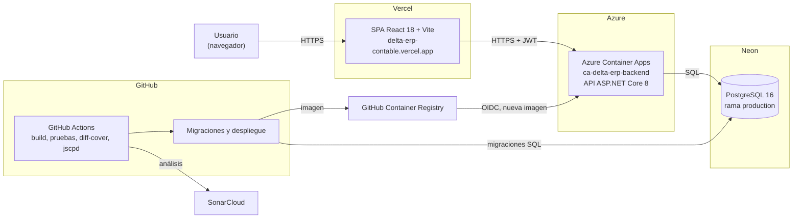
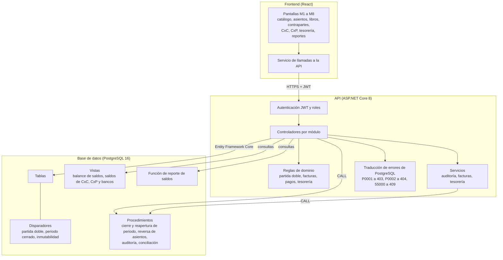
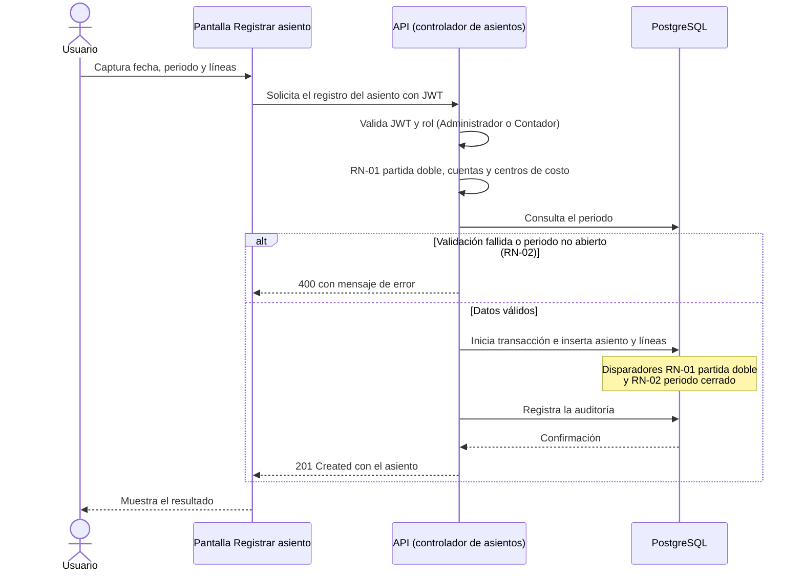
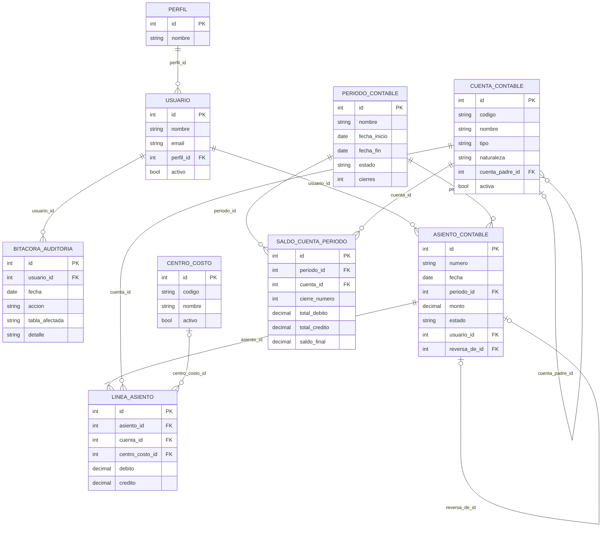
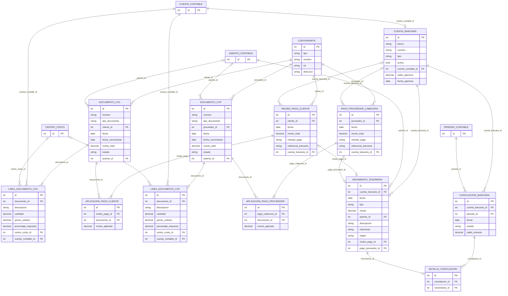
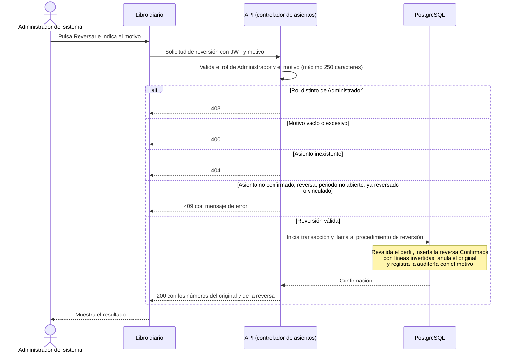
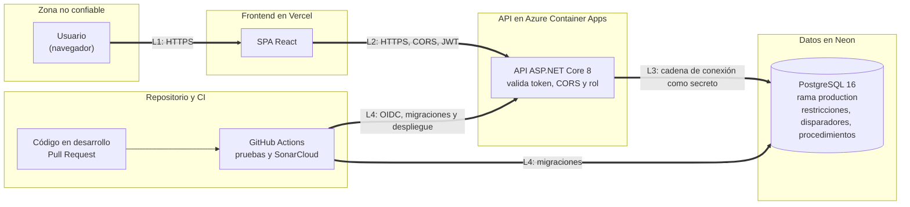

# Entrega y exposición del código de la aplicación desarrollada para la Transformación Digital y Manual de usuario

**Universidad Mariano Gálvez de Guatemala (UMG)**
Ingeniería en Sistemas de Información y Ciencias de la Computación
Curso: Seminario de Tecnologías de Información
Catedrático: Erick Aguilar
Curso vinculado: Seguridad y Auditoría de Sistemas
Proyecto: Delta ERP Contable (DEC)
Grupo 6
Fecha: 09/10/2026

| Carné | Integrante | Rol en el proyecto |
| --- | --- | --- |
| 0900-22-2697 | David Edgar Recinos García | Product Owner |
| 0900-22-9094 | Alejandro Rocael Ochoa Pérez | Scrum Master |
| 0900-22-15963 | José Rodolfo López y López | Equipo de desarrollo |
| 0900-15-3121 | Luis David Reyes Mijangos | Equipo de desarrollo |

---

## Índice

1. Documentación de la aplicación
   1. Proceso seleccionado
   2. Solución desarrollada
   3. Código fuente
   4. Puesta en producción
   5. Pruebas
   6. Resultados
2. Seguridad de la solución
   1. Requerimientos
   2. Arquitectura y UML
   3. Datos y base de datos
   4. DevOps
   5. Aplicación
   6. Usuario y producción
3. Conclusiones y anexos

Los apartados 1.1 a 1.6 y 2.1 a 2.6 corresponden, en ese orden, a los puntos de Documentación y de Seguridad de la rúbrica. El apartado 3 reúne las conclusiones y los anexos.

---

## Entregable 11 (8 pts): Entrega y exposición del código de la aplicación desarrollada para la Transformación Digital y Manual de usuario

El presente documento expone la aplicación Delta ERP Contable (DEC), desarrollada para automatizar el control contable interno de la empresa Delta. El documento relaciona el problema identificado, el proceso seleccionado, la solución tecnológica, la seguridad incorporada y los beneficios obtenidos. Cada afirmación sobre el sistema cita su evidencia: captura de pantalla, extracto de configuración, prueba automatizada, elemento de Azure Boards o métrica de SonarCloud.

La tabla siguiente resume la cadena problema, proceso, solución, seguridad y beneficio. Los apartados 1.1, 1.2, 1.6 y la sección 2 la desarrollan con su evidencia.

| Problema | Proceso afectado | Solución | Seguridad asociada | Beneficio |
| --- | --- | --- | --- | --- |
| Errores y pérdida de trazabilidad | Registro de transacciones | Registro de asientos con partida doble y reversión (M2) | Disparadores RN-01 a RN-03 y bitácora inmutable (apartado 2.3) | Asientos íntegros y auditables |
| Datos fragmentados | Cuentas por cobrar, por pagar y tesorería | Base de datos única accesible mediante la API (M4 a M6) | Autorización por perfil y límite de pago RN-05 (apartados 2.2 y 2.5) | Saldos consistentes y cartera controlada |
| Reportes tardíos y despliegue manual | Emisión de reportes y entrega de versiones | Reportes en línea (M7) y entrega continua | Migraciones controladas, secretos y OIDC (apartado 2.4) | Información oportuna y despliegues repetibles |

Los enlaces públicos que respaldan la evidencia son los siguientes.

| Recurso | Enlace |
| --- | --- |
| Aplicación (frontend) | https://delta-erp-contable.vercel.app |
| Repositorio de código | https://github.com/DavidsitoPay/erp-contable-delta |
| Ejecuciones de CI/CD | https://github.com/DavidsitoPay/erp-contable-delta/actions |
| API del backend (salud) | https://ca-delta-erp-backend.blueisland-6ba0c2e2.eastus2.azurecontainerapps.io/health |
| Calidad de código | https://sonarcloud.io/summary/new_code?id=DavidsitoPay_erp-contable-delta&branch=main |
| Planificación Scrum | https://dev.azure.com/drecinosg2/erp-contable-delta |

---

# 1. Documentación de la aplicación

## 1.1 Proceso seleccionado

### Proceso actual

Delta es una empresa guatemalteca fundada en 1991. Se dedica al análisis, diseño y desarrollo de sistemas de información. Cuenta con más de 45 colaboradores, ha atendido a más de 200 clientes y presta servicio a más de 2,000 usuarios.

El proceso seleccionado es el **control contable interno** de Delta. Este proceso comprende el registro de transacciones financieras, el control de cuentas por cobrar y por pagar, la conciliación bancaria y la emisión de reportes financieros. Actualmente se ejecuta con hojas de cálculo administradas de forma independiente, correo electrónico y, en algunos casos, documentación en papel. Los requerimientos de este control no están documentados. Residen en la práctica diaria del personal administrativo.

### Problema y necesidad

Delta enfrenta cinco problemas en su control contable interno. La tabla los relaciona con la capacidad que el sistema incorpora para atenderlos.

| Problema identificado | Efecto en la operación | Capacidad del DEC que lo atiende |
| --- | --- | --- |
| Procesos manuales y herramientas no integradas | Control contable disperso en hojas de cálculo, correos y papel | Aplicación web única con base de datos centralizada |
| Fragmentación de los datos | Cada colaborador conserva su versión de la información. No existe una única fuente de verdad | Base de datos PostgreSQL compartida y accesible solo mediante la API |
| Riesgo de errores y pérdida de trazabilidad | Duplicación de registros. Transacciones difíciles de rastrear | Reglas de integridad en la base de datos (RN-01, RN-02, RN-03, RN-05) y bitácora de auditoría inmutable (RN-08) |
| Dificultad para la toma de decisiones | Reportes financieros tardíos | Libros contables, balance de saldos, balance general y estado de resultados calculados en línea |
| Insostenibilidad ante el crecimiento | El esfuerzo manual crece con el volumen de transacciones. La confiabilidad disminuye | Registro transaccional automatizado y control de saldos de cartera por vista |

La necesidad se resume en una contradicción operativa: Delta digitaliza los procesos de sus clientes, pero opera su propio control contable sin digitalizar.

### Justificación de la automatización

La automatización se justifica por tres razones sustentadas en la documentación del proyecto.

1. **Alineación estratégica.** El primer objetivo estratégico de Delta es digitalizar la operación contable interna mediante un ERP propio bajo el modelo SaaS.
2. **Reducción de riesgo contable.** Las reglas de partida doble, periodos cerrados y límites de pago pueden verificarse de forma automática. En el proceso manual dependen de la revisión visual de cada persona.
3. **Capacidad técnica existente.** Delta domina .NET, ASP.NET Core y PostgreSQL. Esta capacidad reduce el costo de desarrollo.

El alcance funcional comprende nueve módulos (M1 a M9). El incremento entregado cubre los módulos M1 a M8. El módulo M9 (importación de catálogo y saldos) permanece en estado de diseño.

El modelo de negocio es SaaS de uso interno. Las evidencias de planificación del alcance documentado se encuentran en Azure Boards: nueve Epics (E1 a E9), nueve Features, diecinueve historias de usuario y veinte Test Cases (TC-01 a TC-20).

[Captura 1: Azure Boards, resultado de una consulta de tipo árbol con los Epics E1 a E9, sus Features y sus historias de usuario (Product Backlog Items), con las columnas ID, Work Item Type, Title y State. Perfil: miembro del proyecto con acceso a la organización `drecinosg2`. Acción previa: abrir Boards > Queries > New query; elegir el tipo "Tree of work items"; en los filtros del elemento principal poner Work Item Type = Epic y State = [Any]; en los filtros de los elementos vinculados poner Work Item Type In Feature, Product Backlog Item; ejecutar la consulta, pasar a la pestaña Results, expandir todo y reducir el zoom del navegador hasta que se vean las filas de E1 a E9 (si no son legibles, tomar dos imágenes consecutivas, E1 a E5 y E6 a E9). La vista Backlog no sirve para esta captura porque oculta los elementos terminados. Demuestra: la descomposición del proceso en módulos, funcionalidades e historias de usuario trazables, y el avance de cada uno; los elementos de la captura correspondientes a E1 a E9 constituyen el alcance documentado. Enlace: https://dev.azure.com/drecinosg2/erp-contable-delta/_queries]

---

## 1.2 Solución desarrollada

### Descripción

Delta ERP Contable (DEC) es una aplicación web de tres capas desacopladas.

- **Capa de presentación.** Aplicación de una sola página (SPA) en React. Realiza validación de forma. No contiene reglas contables ni acceso directo a la base de datos.
- **Capa de lógica y servicios.** API REST en C# sobre ASP.NET Core 8. Concentra la autenticación, la autorización por perfil y la mayor parte de las reglas de negocio.
- **Capa de datos.** Base de datos PostgreSQL. Incluye integridad referencial, restricciones de dominio, procedimientos almacenados y disparadores que garantizan las reglas que no pueden delegarse en la aplicación.

*Figura 1. Diagrama de arquitectura.*

*Figura 2. Diagrama de componentes.*

El diagrama de secuencia describe el flujo crítico de registro de un asiento contable.

*Figura 3. Diagrama de secuencia del flujo crítico.*

Los diagramas entidad-relación describen el modelo de datos en dos partes: el núcleo contable y los módulos de cuentas por cobrar, cuentas por pagar y tesorería. La clave primaria (PK) identifica cada fila de una entidad. La clave foránea (FK) referencia la clave primaria de otra entidad, y la etiqueta de cada línea indica la columna de unión. La entidad de saldos por periodo es una tabla que se escribe una sola vez al cierre y se identifica por su propia clave primaria.

*Figura 4. Modelo entidad-relación del núcleo contable.*

*Figura 5. Modelo entidad-relación de cuentas por cobrar, cuentas por pagar y tesorería.*

### Funcionalidades

La tabla relaciona cada módulo con su funcionalidad implementada y la pantalla donde se utiliza.

| Módulo | Funcionalidad | Pantalla (menú) | Estado |
| --- | --- | --- | --- |
| M1 Catálogo y parametrización | Cuentas contables jerárquicas, centros de costo, periodos contables con cierre y reapertura | Cuentas contables, Centros de costo, Periodos | Implementado |
| M2 Registro de transacciones | Registro de asientos con validación de partida doble. Reversión de asientos mediante asiento inverso: solo el Administrador del sistema la ejecuta, con motivo obligatorio, sobre asientos confirmados de periodos abiertos sin vínculo con cuentas por cobrar, por pagar o tesorería | Registrar asiento; Libro diario (acción Reversar) | Implementado |
| M3 Libros contables | Balance de saldos con acumulación jerárquica, libro diario, libro mayor con saldo acumulado. El libro diario muestra el estado del asiento (Confirmado o Anulado) y el vínculo entre el asiento original y su reversa | Balance de saldos, Libro diario, Libro mayor | Implementado |
| M4 Cuentas por cobrar | Facturas a clientes, cobros con aplicación a facturas, saldo pendiente calculado | Clientes y proveedores, Cuentas por cobrar | Implementado |
| M5 Cuentas por pagar | Facturas de proveedores, pagos con aplicación a facturas, saldo pendiente calculado | Clientes y proveedores, Cuentas por pagar | Implementado |
| M6 Tesorería | Cuentas bancarias, movimientos, transferencias, conciliación bancaria con saldo de extracto | Tesorería | Implementado |
| M7 Reportes | Balance general y estado de resultados por periodo | Balance general, Estado de resultados | Implementado |
| M8 Seguridad y auditoría | Autenticación con JWT, autorización por perfil, bitácora de auditoría inmutable | Inicio de sesión | Implementado |
| M9 Importación | Carga masiva desde CSV | No aplica | En diseño (TC-17 y TC-18 en estado Design) |

### Tecnologías

| Capa | Tecnología |
| --- | --- |
| Frontend | React 18, React Router 6, Axios, Vite 5 |
| Backend | ASP.NET Core 8, Entity Framework Core 8 con Npgsql, autenticación JWT Bearer |
| Base de datos | PostgreSQL en Neon (servicio sin servidor), ramas `production` y `development` |
| Contenedores | Docker, imagen de dos etapas |
| Hospedaje del backend | Azure Container Apps (nivel Consumption), recurso `ca-delta-erp-backend` en el grupo `rg-delta-erp` |
| Hospedaje del frontend | Vercel |
| Integración y despliegue continuos | GitHub Actions, GitHub Container Registry (GHCR), autenticación federada OIDC hacia Azure |
| Calidad | SonarCloud, `diff-cover`, `jscpd` |
| Pruebas | xUnit con `WebApplicationFactory` sobre PostgreSQL 16 real. Vitest con React Testing Library |
| Gestión del proyecto | Azure Boards (Scrum) |

---

## 1.3 Código fuente

### Organización del repositorio

El código se aloja en GitHub (https://github.com/DavidsitoPay/erp-contable-delta). La rama `main` representa el estado desplegado en producción. La rama `dev` es la rama de trabajo del equipo. El repositorio se organiza en un directorio por responsabilidad.

| Componente | Contenido |
| --- | --- |
| Backend | Tres proyectos de .NET: la API (13 controladores, autenticación, servicios y modelos de entrada), el dominio (entidades y reglas puras sin acceso a datos) y la infraestructura (contexto de Entity Framework Core). Un cuarto proyecto reúne las pruebas unitarias y de integración |
| Frontend | Componentes de React agrupados por módulo, servicio centralizado de llamadas a la API y utilidades |
| Base de datos | Scripts SQL numerados, desde las tablas hasta la función de reportes, un script de aplicación ordenada de migraciones y datos de demostración |
| DevOps | Definición de la imagen de contenedor y script de creación de la aplicación en Azure |
| Flujos de trabajo | Cuatro flujos de GitHub Actions: verificación de la rama de trabajo, despliegue del backend, reasignación del dominio del frontend y análisis de SonarCloud |
| Documentación | Arquitectura, reglas de negocio, diccionario de datos, backlog, plan de pruebas y diagramas |

[Captura 2: página principal del repositorio en GitHub mostrando las carpetas `backend`, `database`, `devops`, `docs`, `frontend` y `.github`, con la rama `main` seleccionada. Perfil: visitante con acceso al repositorio. Acción previa: abrir la página del repositorio con la rama `main`. Demuestra: que el código fuente está organizado por capa y versionado en un repositorio central. Enlace: https://github.com/DavidsitoPay/erp-contable-delta]

### Componentes principales

**Backend.**

- La configuración de inicio de la API registra el contexto de datos y los servicios. Configura la autenticación JWT con validación de emisor, audiencia, vigencia y firma, la política de CORS configurable y el punto de salud `/health`. Swagger se habilita solo en el entorno de desarrollo.
- El módulo de roles define los cuatro perfiles y los grupos de roles autorizados por módulo (catálogo, cuentas por cobrar, cuentas por pagar, tesorería y registro de pagos).
- El servicio de tokens emite el JWT firmado con HMAC-SHA256. Incluye identificador, nombre, correo y perfil del usuario, con vigencia configurable (60 minutos por defecto).
- El controlador de autenticación verifica la contraseña con el componente de hash de ASP.NET Core Identity. Responde 401 con el mismo mensaje cuando el usuario no existe, está inactivo o la contraseña es incorrecta.
- Existe un controlador por recurso: asientos, centros de costo, conciliaciones, contrapartes, cuentas bancarias, cuentas contables, cuentas por cobrar, cuentas por pagar, libros, movimientos de tesorería, periodos contables y reportes. Cada uno exige autenticación o un rol específico.
- El controlador de asientos expone la reversión: valida el rol de Administrador, el motivo (hasta 250 caracteres) y los bloqueos por estado, periodo y vínculos, y ejecuta el procedimiento de reversión con auditoría en una sola transacción.
- El servicio de auditoría ejecuta la operación de negocio y la llamada al procedimiento almacenado de auditoría dentro de una misma transacción.
- Los servicios de validación contable, de facturas y de tesorería concentran las validaciones y la construcción de los asientos de facturas y movimientos bancarios.
- El traductor de errores de PostgreSQL convierte los códigos de error de los procedimientos almacenados en respuestas HTTP: `P0001` en 403, `P0002` en 404 y `55000` en 409.

**Dominio.** Reglas puras verificables sin base de datos: validador de partida doble (RN-01). Constructores de asientos de facturas y de tesorería, que cuadran por construcción. Reglas de pago (RN-05), de facturas y de tesorería, jerarquía de cuentas y cálculo de estados financieros (balance general y estado de resultados).

**Base de datos.** Los scripts SQL se aplican en orden numérico.

| Objeto | Contenido principal |
| --- | --- |
| Tablas | Seguridad, catálogo, núcleo contable, cuentas por cobrar, cuentas por pagar y tesorería |
| Funciones | Funciones de soporte |
| Disparadores | RN-01 (partida doble diferida), RN-02 (bloqueo de periodo cerrado), RN-03 (prohibición de eliminar asientos), RN-05 (límite de pago en cuentas por cobrar y por pagar), inmutabilidad de bitácora y saldos de cierre |
| Procedimientos almacenados | Registro de auditoría, cierre y reapertura de periodo, reversión de asientos con motivo y vínculo entre original y reversa, y finalización de conciliación |
| Vistas | Balance de saldos, saldo de documentos de cuentas por cobrar y por pagar, saldo de cuentas bancarias |
| Verificación de perfil | Función que comprueba el perfil autorizado dentro de los procedimientos |
| Correcciones y reportes | Ajustes de balance y cierre, tesorería, balance jerárquico y función de reportes de saldos |
| Migraciones | Aplicación ordenada de los scripts pendientes, con registro en una tabla de control de migraciones |

**Frontend.**

- El componente raíz define el menú y las rutas. Muestra las pestañas Registrar asiento, Tesorería, Balance general y Estado de resultados solo a los perfiles Administrador del sistema y Contador.
- El servicio de API centraliza las llamadas al backend. Un interceptor añade el encabezado `Authorization: Bearer` a cada solicitud.
- El componente de inicio de sesión autentica y conserva el token y los datos del usuario en el almacenamiento local del navegador.
- El libro diario muestra el estado de cada asiento y, solo al Administrador del sistema, la acción Reversar con un diálogo que exige el motivo (máximo 250 caracteres).
- Los componentes se agrupan por módulo: catálogo, asientos, libros, contrapartes, cuentas por cobrar, cuentas por pagar, tesorería y reportes.

[Captura 3: GitHub, vista de código del archivo `backend/src/DeltaERP.Api/Program.cs` con el bloque de configuración visible desde la autenticación JWT hasta el punto de salud `/health` (autenticación JWT, CORS y punto de salud). Perfil: visitante con acceso al repositorio. Acción previa: abrir el archivo en la rama `main` y desplazarse hasta el bloque `AddAuthentication`/`AddJwtBearer`, de modo que se vea hasta la declaración `MapGet("/health")`. Demuestra: la configuración central de autenticación y exposición de la API. Enlace: https://github.com/DavidsitoPay/erp-contable-delta/blob/main/backend/src/DeltaERP.Api/Program.cs]

[Captura 4: GitHub, vista de código del archivo `database/03_triggers.sql` con la función `fn_validar_partida_doble` y su disparador `trg_validar_partida_doble` visibles. Perfil: visitante con acceso al repositorio. Acción previa: abrir el archivo en la rama `main`. Demuestra: que la regla RN-01 se aplica en la capa de datos. Enlace: https://github.com/DavidsitoPay/erp-contable-delta/blob/main/database/03_triggers.sql]

### Flujo del registro de un asiento (explicación de un componente crítico)

El registro de un asiento recorre los siguientes pasos, implementados en el controlador de asientos.

1. El frontend envía la solicitud de registro con el token del usuario.
2. La API verifica el rol. Un perfil distinto de Administrador del sistema o Contador recibe 403.
3. El validador de partida doble comprueba RN-01. Un asiento descuadrado recibe 400 y no se registra.
4. La API verifica que las cuentas y los centros de costo existan y estén activos.
5. La API verifica que el periodo exista y esté abierto (RN-02).
6. La API asigna el identificador de usuario desde el token y recalcula el monto en el servidor. El cliente no define estos valores.
7. La API persiste el asiento y registra la auditoría en una sola transacción.
8. El disparador diferido de partida doble vuelve a verificar RN-01 al confirmar la transacción.

### Flujo de la reversión de un asiento (RN-03)

Un asiento confirmado no se elimina ni se edita. Se corrige con un asiento de reversión, que invierte sus líneas. La operación recorre los siguientes pasos.

1. El libro diario envía la solicitud de reversión con el motivo.
2. Un rol distinto de Administrador del sistema recibe 403.
3. Un motivo vacío o de más de 250 caracteres recibe 400.
4. Un asiento inexistente recibe 404.
5. Un asiento no confirmado, que ya es una reversa, de un periodo no abierto, ya reversado o vinculado a cuentas por cobrar, por pagar o tesorería recibe 409.
6. El procedimiento de reversión revalida el perfil en la base de datos. Registra la reversa como asiento Confirmado, con las líneas invertidas y en el mismo periodo. Marca el original como Anulado y escribe la auditoría con el motivo. Todo ocurre en una transacción.
7. La API responde 200 con los números del original y de la reversa.

La fecha de la reversa es la fecha actual limitada al fin del periodo, sin ser anterior a la del asiento original. La Figura 6 representa la secuencia.

*Figura 6. Diagrama de secuencia de la reversión de un asiento.*

El sistema impide reversar los asientos generados por facturas de cuentas por cobrar o por pagar y por movimientos de tesorería (cobros, pagos, transferencias y apertura). El control protege la coherencia entre el libro diario y los libros auxiliares y opera en tres capas. El procedimiento de reversión rechaza la operación. La API responde 409 con el mismo mensaje. El libro diario no muestra el botón Reversar en esos asientos. Pruebas de integración cubren los tres casos y una prueba de interfaz verifica la ausencia del botón.

[Captura 5: aplicación web, Libro diario del periodo abierto, con un asiento manual confirmado y el botón "Reversar" visible en la columna Estado, y el diálogo "Reversar asiento" abierto con el campo Motivo completado y el aviso de anulación del original y generación de la reversa. Perfil: usuario de demostración con perfil Administrador del sistema. Acción previa: registrar un asiento manual de prueba sin vínculo con cuentas por cobrar, por pagar ni tesorería; abrir el Libro diario, seleccionar el periodo, pulsar Reversar en ese asiento y digitar un motivo sin confirmar. Demuestra: que la acción solo aparece para asientos reversibles y para el Administrador, y que el motivo es obligatorio. Enlace: https://delta-erp-contable.vercel.app]

[Captura 6: Libro diario tras confirmar la reversión, con el mensaje "Asiento ... anulado. Reversa REV-... registrada.", la insignia "Anulado — reversado por REV-..." en el asiento original y "Reversa de ..." en la reversa Confirmada. Perfil: usuario de demostración con perfil Administrador del sistema. Acción previa: confirmar el diálogo de la Captura 5 sobre el asiento de prueba. Demuestra: el resultado de la reversión y la trazabilidad entre el original y la reversa (RN-03). Enlace: https://delta-erp-contable.vercel.app]

[Captura 7: Libro diario con un asiento generado por una factura de cuentas por cobrar (o por pagar) en estado Confirmado, sin el botón "Reversar" en la columna Estado. Perfil: usuario de demostración con perfil Administrador del sistema. Acción previa: abrir el Libro diario, seleccionar el periodo y ubicar el asiento generado por una factura. Demuestra: que el sistema no ofrece la reversión de asientos vinculados a los libros auxiliares. Enlace: https://delta-erp-contable.vercel.app]

---

## 1.4 Puesta en producción

### Entorno

| Componente | Servicio | Detalle |
| --- | --- | --- |
| Frontend | Vercel | Dominio `https://delta-erp-contable.vercel.app`. Despliegue de producción desde `main` |
| Backend | Azure Container Apps | Aplicación `ca-delta-erp-backend`, grupo de recursos `rg-delta-erp`. Ingreso externo, puerto 5000, de cero a dos réplicas |
| Base de datos | Neon (PostgreSQL) | Proyecto `lingering-cell-09535323`, rama `production` usada por el backend desplegado. La rama `development` se destina al trabajo local |
| Registro de imágenes | GitHub Container Registry | Imagen `ghcr.io/davidsitopay/erp-contable-delta-backend`, etiquetada con el hash del commit |

La comunicación entre capas sigue la ruta navegador, frontend (HTTPS), backend (HTTPS con JSON) y base de datos (SQL mediante Npgsql y EF Core).

### Proceso de despliegue

El despliegue es automático y se activa con cada cambio en la rama `main`. El flujo de despliegue del backend define dos trabajos encadenados.

1. **Migración.** Instala el cliente de PostgreSQL y ejecuta el script de migraciones contra la rama `production` de Neon. El script aplica en orden solo los scripts que no figuran en la tabla de control de migraciones y detiene el proceso ante el primer error.
2. **Construcción y despliegue.** Depende del trabajo de migración. Construye la imagen de contenedor de dos etapas, la publica en GHCR, se autentica en Azure mediante OIDC y actualiza la aplicación de contenedor con la nueva imagen. Si la migración falla, la imagen nueva no se construye.

El frontend se despliega mediante la integración nativa de Vercel con GitHub. Un flujo adicional reasigna el dominio corto al despliegue de producción más reciente.

Antes de llegar a `main`, cada cambio pasa por la verificación del flujo de la rama `dev` y por el análisis de SonarCloud en el Pull Request. El apartado 1.5 describe ambos.

[Captura 8: pestaña Actions del repositorio, filtrada por el flujo "Backend — build y despliegue a Azure Container Apps" (archivo `backend-deploy.yml`), con varias ejecuciones exitosas de la rama `main`. Perfil: colaborador del repositorio. Acción previa: abrir Actions y seleccionar el flujo en el panel izquierdo. Demuestra: que el despliegue automático se ejecuta de forma repetida y exitosa. Enlace: https://github.com/DavidsitoPay/erp-contable-delta/actions/workflows/backend-deploy.yml]

[Captura 9: detalle de una ejecución exitosa de `backend-deploy.yml` con los trabajos `migrate` y `build-and-deploy` en verde y la sección "Summary" con "Migraciones (Neon production)" y "Backend desplegado" (imagen, commit y enlace de salud). Perfil: colaborador del repositorio. Acción previa: abrir la ejecución más reciente del flujo. Demuestra: la secuencia migración y despliegue, y la imagen desplegada. Enlace: https://github.com/DavidsitoPay/erp-contable-delta/actions]

### Evidencias de funcionamiento

[Captura 10: portal de Azure, pestaña Overview de la aplicación `ca-delta-erp-backend` con el dominio de la aplicación (FQDN) y el estado "Running" de la revisión activa. Perfil: propietario de la suscripción de Azure. Acción previa: abrir el grupo `rg-delta-erp` y seleccionar la aplicación. Demuestra: que el backend se ejecuta en Azure Container Apps. Enlace: https://portal.azure.com]

[Captura 11: navegador mostrando la respuesta del punto de salud del backend en la ruta `/health`, con el cuerpo `{"status":"ok","service":"Delta ERP Contable API"}`. Perfil: no requiere autenticación. Acción previa: abrir en el navegador la URL https://ca-delta-erp-backend.blueisland-6ba0c2e2.eastus2.azurecontainerapps.io/health. Demuestra: que el backend desplegado responde por HTTPS. Enlace: https://ca-delta-erp-backend.blueisland-6ba0c2e2.eastus2.azurecontainerapps.io/health]

[Captura 12: panel de Vercel, pestaña Deployments, con el despliegue de producción más reciente en estado "Ready" y la rama `main` como origen. Perfil: propietario del proyecto en Vercel. Acción previa: abrir el proyecto `delta-erp-contable`. Demuestra: que el frontend está desplegado en producción. Enlace: https://vercel.com/dashboard]

[Captura 13: consola de Neon, vista Branches del proyecto `lingering-cell-09535323` con las ramas `production` y `development` como ramas separadas. Perfil: propietario del proyecto en Neon. Acción previa: abrir el proyecto y la sección Branches. Demuestra: la separación entre el ambiente productivo y el de desarrollo. Enlace: https://console.neon.tech]

---

## 1.5 Pruebas

### Estrategia

Las pruebas se organizan en dos suites que se ejecutan en GitHub Actions con un contenedor de servicio `postgres:16`.

| Suite | Herramienta | Cantidad | Alcance |
| --- | --- | --- | --- |
| Backend | xUnit | 308 métodos de prueba (`[Fact]` o `[Theory]`) | Pruebas unitarias de las reglas del dominio. Pruebas de integración con `WebApplicationFactory` contra PostgreSQL real, de modo que los disparadores actúan como en producción |
| Frontend | Vitest y React Testing Library | 34 archivos de prueba con 253 casos declarados (`it` o `test`) | Componentes, utilidades y servicio de API |

El conteo corresponde a la declaración en el código. Los casos parametrizados (`[Theory]`) generan ejecuciones adicionales. La cifra de ejecuciones del reporte de CI es la evidencia definitiva (Captura 14).

### Controles de calidad en CI

| Control | Dónde | Umbral |
| --- | --- | --- |
| Suite completa de pruebas con PostgreSQL real | Flujo de verificación (push a `dev`) y flujo de SonarCloud (Pull Request y `main`) | Cero pruebas fallidas |
| Cobertura de líneas cambiadas (`diff-cover`) | Flujo de verificación de `dev` | Mínimo 80 % frente a `main` |
| Duplicación de código (`jscpd`) | Flujo de verificación de `dev` | Falla ante cualquier bloque de 80 tokens o más |
| Quality gate de SonarCloud | Flujo de SonarCloud | Cobertura mínima de 80 % y duplicación máxima de 3 % sobre código nuevo |
| Análisis de seguridad y calidad estático | Flujo de SonarCloud | Resultado visible en SonarCloud |

[Captura 14: GitHub Actions, ejecución exitosa del flujo "SonarCloud — análisis de código" (archivo `sonarcloud-analysis.yml`; alternativa: "Pruebas — backend y frontend (dev)", archivo `backend-build-check.yml`) con la sección de resultados "Pruebas backend" y "Pruebas frontend" mostrando el total de pruebas aprobadas, y el paso "Gate de coverage" en verde. Perfil: colaborador del repositorio. Acción previa: abrir la ejecución de CI correspondiente al merge que incorporó la reversión de asientos (no la ejecución más reciente, para que el conteo coincida con las cifras del apartado 1.5) y expandir la pestaña Summary. Demuestra: el número real de pruebas ejecutadas y que los controles de calidad se aprueban. Enlace: https://github.com/DavidsitoPay/erp-contable-delta/actions]

[Captura 15: SonarCloud, resumen del proyecto `DavidsitoPay_erp-contable-delta` en la rama `main` con el estado del Quality Gate, la cobertura y la duplicación. Perfil: visitante con acceso al proyecto público. Acción previa: abrir el resumen y la pestaña "Overall Code" o "New Code". Demuestra: los valores de cobertura y duplicación vigentes (la captura muestra Quality Gate aprobado, cobertura de 98.8 %, duplicación de 0.0 % y 9,713 líneas de código en `main`). Enlace: https://sonarcloud.io/summary/new_code?id=DavidsitoPay_erp-contable-delta&branch=main]

### Casos de prueba y resultados

Los casos de prueba son elementos de tipo Test Case en Azure Boards (organización `drecinosg2`, proyecto `erp-contable-delta`). Cada caso es hijo de la historia de usuario que verifica. El alcance documentado comprende 20 casos: 18 automatizados en estado Closed y 2 en estado Design (TC-17 y TC-18).

| Caso | ID Azure | Historia | Verificación | Resultado | Prueba automatizada (ejemplo) |
| --- | --- | --- | --- | --- | --- |
| TC-01 CRUD CuentaContable | 169 | E1-F1-H1 | Jerarquías válidas. Rechazo de ciclos y de tipo y naturaleza inconsistentes | Closed, automatizado | Creación de una cuenta con datos inválidos responde 400 |
| TC-02 CentroCosto y cierre de periodo | 170 | E1-F1-H2 | Alta de centro de costo. Cierre y reapertura con control de perfil | Closed, automatizado | Cierre o reapertura con perfil no autorizado en la base responde 403 sin cambiar el periodo |
| TC-03 Modelo EF Core | 171 | E2-F1-H1 | Mapeo contra el esquema real | Closed, automatizado | Las columnas mapeadas de asiento y líneas existen en la base real |
| TC-04 Asiento descuadrado (RN-01) | 172 | E2-F1-H2 | Rechazo de asientos que incumplen partida doble | Closed, automatizado | Un asiento que incumple la partida doble responde 400 y no crea registros |
| TC-05 Balance de saldos | 173 | E3-F1-H1 | Saldo según naturaleza. Exclusión de borradores | Closed, automatizado | El balance con asientos confirmados expone totales y saldo por naturaleza |
| TC-06 Libro diario y mayor | 174 | E3-F1-H2 | Orden por fecha y saldo acumulado | Closed, automatizado | El libro diario lista los asientos contabilizados por fecha y excluye borradores |
| TC-07 CRUD DocumentoCxC | 175 | E4-F1-H1 | Cliente existente (RN-04). Asiento balanceado | Closed, automatizado | Una factura con cliente inexistente responde 400 sin crear registros |
| TC-08 Pagos CxC (RN-05) | 187 | E4-F1-H2 | El pago no excede el saldo pendiente | Closed, automatizado | Un pago que excede el saldo se rechaza por RN-05 sin alterar el saldo |
| TC-09 CRUD DocumentoCxP | 176 | E5-F1-H1 | Proveedor existente (RN-04) | Closed, automatizado | Una factura con proveedor inexistente responde 400 sin crear registros |
| TC-10 Pagos CxP (RN-05) | 177 | E5-F1-H2 | El pago no excede el saldo pendiente | Closed, automatizado | Un pago que excede el saldo se rechaza por RN-05 sin alterar el saldo |
| TC-11 Cuentas bancarias y movimientos | 178 | E6-F1-H1 | El saldo se deriva de los movimientos | Closed, automatizado | Un ingreso aumenta el saldo en la vista y en el punto de acceso de la API |
| TC-12 Conciliación bancaria (RN-10) | 179 | E6-F1-H2 | Solo un perfil autorizado finaliza | Closed, automatizado | Finalizar con perfil no autorizado responde 403 |
| TC-13 Balance general | 180 | E7-F1-H1 | Clasificación por tipo. Uso del cierre en periodos cerrados | Closed, automatizado | El balance clasifica por tipo y usa el cierre en un periodo cerrado |
| TC-14 Estado de resultados | 181 | E7-F1-H2 | Solo cuentas de ingreso y gasto del periodo | Closed, automatizado | El estado de resultados incluye solo ingresos y gastos del periodo |
| TC-15 Inicio de sesión | 182 | E8-F1-H1 | Token con credenciales válidas. 401 con credenciales inválidas | Closed, automatizado | Credenciales inválidas responden 401 |
| TC-16 Autorización por rol y auditoría | 183 | E8-F1-H2 | 403 sin rol. Registro en bitácora. Bitácora inmutable | Closed, automatizado | Un UPDATE o DELETE directo sobre la bitácora es rechazado por el disparador |
| TC-17 Validación de CSV (RN-11) | 184 | E9-F1-H1 | Rechazo de archivos con errores | Design (módulo M9 no implementado) | No aplica |
| TC-18 Inserción transaccional | 185 | E9-F1-H2 | Importación atómica | Design (módulo M9 no implementado) | No aplica |
| TC-19 Balance y mayor jerárquicos | 270 | E3-F1 (PBI 269) | Acumulación del saldo de subcuentas en la cuenta padre | Closed, automatizado | El balance acumula las subcuentas en el padre y el mayor del padre incluye los movimientos de sus subcuentas |
| TC-20 Reversión de asientos | 272 | E2-F1-H3 | Solo el Administrador reversa un asiento confirmado, con motivo. Original Anulado, reversa Confirmada, saldo neto cero. 403 con Contador, 400 sin motivo, 409 con periodo cerrado o vínculos | Closed, automatizado | La reversión por un Administrador con motivo responde 200, anula el original y crea la reversa confirmada |

[Captura 16: Azure Boards, consulta o tablero de elementos de tipo Test Case mostrando los casos TC-01 a TC-20 del alcance documentado, identificables por el título, con su estado (Closed o Design) y, en el detalle de uno de ellos, el campo "Automation status" con el valor "Automated". Perfil: miembro del proyecto. Acción previa: crear o abrir una consulta de Boards con filtro Work Item Type = Test Case y agregar las columnas Estado y Automation status. Demuestra: la trazabilidad entre las historias de usuario, los casos de prueba y su automatización. Enlace: https://dev.azure.com/drecinosg2/erp-contable-delta/_workitems]

---

## 1.6 Resultados

### Beneficios obtenidos

Los beneficios se relacionan con el problema del apartado 1.1. Se describen de forma cualitativa porque el proyecto no dispone de mediciones de la operación manual previa. Los indicadores definidos para el proyecto son el tiempo de generación de estados financieros, el tiempo promedio de cobro y el porcentaje de registros duplicados. Su medición con datos reales corresponde a una fase posterior a la puesta en operación.

| Problema | Beneficio obtenido | Evidencia |
| --- | --- | --- |
| Datos fragmentados | Una única base de datos accesible solo mediante la API. Cada transacción se registra una vez | Arquitectura de tres capas (apartado 1.2) |
| Errores contables | La base de datos rechaza todo asiento descuadrado (RN-01), toda modificación en un periodo cerrado (RN-02) y toda eliminación física de asientos (RN-03), cuya corrección se realiza con un asiento de reversión | Disparadores de la base de datos. Casos TC-04, TC-02 y TC-20 |
| Saldos inconsistentes | Las entidades no almacenan un saldo editable. Los saldos de cuentas, cartera y bancos se derivan de vistas en tiempo real | Diseño del modelo de datos. Casos TC-05, TC-11 y TC-19 |
| Pérdida de trazabilidad | Cada operación relevante registra usuario, fecha, acción y detalle en una bitácora que ningún perfil de la aplicación, incluido el Administrador del sistema, puede alterar | Servicio de auditoría y disparador de inmutabilidad. Caso TC-16 |
| Control de cartera | El pago no excede el saldo pendiente (RN-05). Cada factura muestra su saldo vigente | Casos TC-08 y TC-10 |
| Cierre contable | El cierre fija una fotografía inmutable de saldos por periodo y conserva versiones ante reaperturas | Procedimiento de cierre y disparador de inmutabilidad. Pruebas de integración de periodos contables |
| Conciliación | La conciliación contrasta movimientos contra el extracto y solo finaliza con diferencia cero | RN-10. Caso TC-12 |
| Reportes tardíos | El balance general y el estado de resultados se generan al instante desde datos consolidados | Función de reportes de saldos. Casos TC-13 y TC-14 |
| Despliegue manual | Cada cambio aprobado en `main` se migra, construye y despliega sin intervención manual | Flujo de despliegue continuo (Capturas 8 y 9) |

### Aporte a la Transformación Digital

1. **Digitalización de la operación interna.** Delta aplica a su propio control contable la misma transformación digital que ofrece a sus clientes. Esto responde a la contradicción operativa descrita en el apartado 1.1.
2. **Modelo SaaS.** El sistema opera en la nube y se actualiza de forma centralizada, sin instalaciones locales. La arquitectura permite evolucionar hacia un producto multiempresa, tal como establece el modelo de negocio.
3. **Caso de referencia.** La solución constituye un caso demostrable ante clientes actuales y potenciales, objetivo estratégico de Delta.
4. **Práctica DevOps.** La entrega continua con migraciones automáticas, pruebas sobre base de datos real y análisis estático reduce el riesgo de cada incremento.

### Limitaciones

- El módulo M9 (importación) está en diseño y no forma parte del incremento.
- El envío de notificaciones por correo SMTP está diseñado y no implementado.
- El estado de un asiento nuevo debe ser Confirmado. No existe flujo de borrador. El estado Anulado lo asigna únicamente la reversión al asiento original.
- La reversión de asientos solo la ejecuta el Administrador del sistema, exige un motivo y se limita a asientos confirmados de periodos abiertos. No se reversa un asiento vinculado a una factura de cuentas por cobrar o por pagar ni a un movimiento de tesorería, porque los libros auxiliares quedarían desincronizados. El sistema impide esa reversión en la base de datos, en la API y en el libro diario.
- Las facturas, los pagos y los movimientos de tesorería no pueden anularse desde sus módulos de origen. La mejora propuesta es incorporar esa anulación, de modo que corrija el documento y su asiento de forma coherente.
- El sistema opera solo en quetzales (GTQ). No existe conversión de moneda ni tipo de cambio.
- El porcentaje de impuesto se digita por línea de factura. No existen parámetros tributarios configurables.
- Los controles de seguridad pendientes se detallan en la sección 2.6.

---

# 2. Seguridad de la solución

La sección responde al curso Seguridad y Auditoría de Sistemas. Cada tema sigue la secuencia riesgo, control implementado, evidencia. Los controles que los requerimientos establecen y que el incremento no implementa se documentan como riesgos residuales en la sección 2.6, con su mitigación propuesta.

## 2.1 Requerimientos

### Riesgos de información, usuarios, aplicación e infraestructura

| Dimensión | Riesgo | Efecto posible |
| --- | --- | --- |
| Información | Alteración de asientos o saldos. Eliminación de trazas | Estados financieros incorrectos. Pérdida de responsabilidad |
| Usuarios | Suplantación de identidad. Acceso de un perfil a funciones ajenas | Operaciones no autorizadas |
| Aplicación | Entradas inválidas. Manipulación de identificadores. Explotación de errores | Registros corruptos. Fuga de información |
| Infraestructura | Exposición de secretos. Intercepción de tráfico. Despliegue comprometido | Acceso a la base de datos. Pérdida de disponibilidad |

### Requerimientos de seguridad y su cumplimiento

El proyecto especifica requerimientos funcionales de seguridad (RF-48 a RF-55, módulo M8) y requerimientos no funcionales de seguridad, disponibilidad e integridad transaccional. La tabla resume cómo se atienden.

| Atributo | Requerimiento | Control implementado | Evidencia |
| --- | --- | --- | --- |
| Autenticación | Usuario y contraseña. Sesión con vigencia limitada (RF-48) | Inicio de sesión con emisión de JWT de 60 minutos | Pruebas de integración del inicio de sesión: el token firmado contiene los datos del usuario y las credenciales inválidas responden 401 |
| Autenticación | Contraseñas almacenadas con derivación y sal | Hash de contraseñas de ASP.NET Core Identity (PBKDF2 con sal) | Formato del valor almacenado, descrito en el apartado 2.3 |
| Autorización | Permisos según perfil (RF-49, RF-51, RN-09) | Roles en el token y exigencia de rol en cada controlador. Verificación de perfil dentro de procedimientos | Pruebas de autorización del apartado 2.5 |
| Privacidad | Comunicación cifrada (HTTPS, TLS 1.2 o superior) | Ingreso HTTPS de Azure Container Apps y de Vercel. CORS con lista de orígenes | Captura 11 y configuración de CORS de la API (Captura 3) |
| Integridad | Partida doble, periodos cerrados, asientos no eliminables, bitácora inmutable | Disparadores y procedimientos en PostgreSQL | Apartado 2.3 |
| Integridad | Registro de asiento atómico: la operación y su auditoría se confirman juntas o se revierten juntas | Transacción única de operación y auditoría | Servicio de auditoría (apartado 2.5) |
| Disponibilidad | Horario laboral cubierto. Respaldo | Escalado administrado en Azure. Punto de salud `/health`. Recuperación de la base mediante las capacidades del plan de Neon | Captura 11. Riesgos residuales en 2.6 |
| Auditoría | Bitácora de operaciones (RF-52) | Procedimiento almacenado de auditoría invocado desde la API | Captura 29 |

---

## 2.2 Arquitectura y UML

### Roles y permisos

El sistema define cuatro perfiles: Administrador del sistema, Contador, Vendedor y Técnico. Los perfiles provienen de la tabla de perfiles de la base de datos. La API agrupa los roles autorizados por módulo: las operaciones de escritura del catálogo y de las cuentas por pagar, el registro de pagos, la tesorería y los reportes se restringen a Administrador del sistema y Contador. Las consultas del catálogo y de cuentas por pagar admiten a cualquier usuario autenticado. Las cuentas por cobrar admiten además al Vendedor. El rol viaja como reclamación de rol dentro del token firmado. La reversión de asientos y la reapertura de periodos se restringen al Administrador del sistema. El servidor no confía en datos de perfil enviados por el cliente.

### Límites de confianza

El diagrama de arquitectura (Figura 1) permite identificar los siguientes límites de confianza. La Figura 7 representa esos límites sobre los componentes del sistema.

| Límite | Lado no confiable | Lado confiable | Control en el límite |
| --- | --- | --- | --- |
| L1: navegador y frontend | Navegador del usuario | SPA servida por Vercel | HTTPS. La SPA solo valida forma |
| L2: frontend y API | Cualquier cliente HTTP | API en Azure Container Apps | HTTPS, CORS con lista de orígenes, validación de token (emisor, audiencia, vigencia y firma) |
| L3: API y base de datos | API | PostgreSQL en Neon | Cadena de conexión como secreto, reglas de integridad en la base, verificación de perfil en procedimientos |
| L4: repositorio y producción | Código en desarrollo | Ambiente productivo | Pull Request obligatorio, pruebas y análisis en CI, OIDC hacia Azure |

La API es el único componente que accede a la base de datos. El frontend no contiene reglas contables.

*Figura 7. Límites de confianza L1 a L4 entre los componentes del sistema.*

### Flujos críticos

| Flujo crítico | Riesgo | Control |
| --- | --- | --- |
| Inicio de sesión | Suplantación. Enumeración de usuarios | Mensaje único "Credenciales inválidas." para usuario inexistente, inactivo y contraseña incorrecta |
| Registro de asiento | Asiento descuadrado. Registro a nombre de otro usuario | RN-01 en API y base. Identificador de usuario tomado del token |
| Cierre y reapertura de periodo | Alteración de periodos consolidados | Verificación de perfil dentro de los procedimientos de cierre y reapertura. Reapertura solo del Administrador |
| Reversión de asiento | Corrección no autorizada o sin justificación | Solo Administrador (token y base de datos), motivo obligatorio registrado en la bitácora, periodo abierto y asiento sin vínculos |
| Aplicación de pagos | Pago superior al saldo | Disparadores de límite de pago en cuentas por cobrar y por pagar (RN-05) |
| Finalización de conciliación | Conciliación sin autorización o con diferencia | Procedimiento de finalización que verifica perfil y diferencia cero (RN-10) |
| Despliegue | Esquema y código desincronizados. Credenciales expuestas | Dependencia entre el trabajo de migración y el de despliegue, OIDC, secretos cifrados |

---

## 2.3 Datos y base de datos

### Protección de información e integridad

| Riesgo | Control implementado | Evidencia de prueba |
| --- | --- | --- |
| Asiento descuadrado | Disparador diferido de partida doble (RN-01) | Un asiento que incumple la partida doble responde 400 y no crea registros |
| Modificación en periodo cerrado | Disparador que bloquea líneas de asiento en periodo cerrado (RN-02) | Una factura de cuentas por cobrar y un movimiento de tesorería en periodo cerrado responden 400 |
| Eliminación de asientos | Disparador que impide la eliminación física (RN-03). La corrección se realiza con un asiento de reversión que solo el Administrador del sistema registra, con motivo obligatorio | Pruebas de integración de la reversión: el original queda Anulado, la reversa queda Confirmada con líneas invertidas y ambos netean cero en los libros. Un Contador recibe 403. Un asiento de periodo cerrado o vinculado recibe 409 |
| Descuadre entre el libro diario y los auxiliares | El procedimiento de reversión rechaza los asientos generados por facturas de cuentas por cobrar o por pagar y por movimientos de tesorería (cobros, pagos, transferencias y apertura). La API responde 409 con el mismo mensaje y el libro diario no muestra el botón Reversar en esos asientos (RN-03) | Pruebas de integración de los tres casos (factura de cuentas por cobrar, factura de cuentas por pagar y movimiento de tesorería) y una prueba de interfaz |
| Pago superior al saldo | Disparadores de límite de pago en cuentas por cobrar y por pagar (RN-05) | Un pago que excede el saldo se rechaza sin alterar el saldo |
| Alteración de la bitácora | Disparador de inmutabilidad que bloquea UPDATE y DELETE | Un UPDATE o DELETE directo sobre la bitácora es rechazado |
| Alteración de saldos de cierre | Disparador de inmutabilidad de los saldos por periodo | Cerrar, reabrir y cerrar de nuevo versiona los saldos y conserva la versión anterior |
| Eliminación de usuarios y cuentas | Disparadores que permiten solo la desactivación | Un DELETE directo sobre cuentas bancarias es rechazado |
| Alteración de movimientos y conciliaciones | Disparadores de inmutabilidad de movimientos bancarios y conciliaciones | Un UPDATE directo sobre un movimiento o una conciliación conciliada es rechazado |
| Saldos manipulables | No existen columnas de saldo editable. Los saldos se derivan de vistas | El balance con asientos confirmados expone totales y saldo por naturaleza |
| Datos inconsistentes | Llaves foráneas, restricciones de dominio y unicidad (por ejemplo, correo electrónico único) | Pruebas de esquema contra la base real, incluido el balance jerárquico |

Las pruebas de integración se ejecutan contra PostgreSQL 16 real. Los disparadores actúan en las pruebas igual que en producción.

[Captura 17: consola de Neon, editor SQL sobre la rama `development` (no `production`) ejecutando `UPDATE bitacoraauditoria SET detalle = 'x' WHERE id = (SELECT MIN(id) FROM bitacoraauditoria);` y mostrando el mensaje de error "BitacoraAuditoria es inmutable: no se permite UPDATE ni DELETE". Perfil: propietario del proyecto en Neon. Acción previa: abrir SQL Editor, seleccionar la rama `development` y ejecutar la sentencia. Demuestra: la inmutabilidad de la bitácora aplicada por la base de datos. Enlace: https://console.neon.tech]

[Captura 18: consola de Neon, editor SQL sobre la rama `development` ejecutando un `INSERT` de un asiento confirmado con una línea de débito sin su línea de crédito (dentro de una transacción) y mostrando el error "RN-01: el asiento ... no cumple partida doble". Perfil: propietario del proyecto en Neon. Acción previa: ejecutar el `INSERT` en la rama `development` y confirmar la transacción. Demuestra: la partida doble aplicada en la base de datos, incluso ante un acceso que omite la API. Enlace: https://console.neon.tech]

[Captura 19: consola de Neon, editor SQL sobre la rama `production` ejecutando el bloque `BEGIN; UPDATE lineaasiento SET debito = debito WHERE asiento_id = (SELECT id FROM asientocontable WHERE periodo_id = (SELECT id FROM periodocontable WHERE nombre = 'Agosto 2026') LIMIT 1); ROLLBACK;` y mostrando el error "RN-02: no se puede modificar un asiento de un periodo cerrado (periodo N)". Perfil: propietario del proyecto en Neon. Acción previa: abrir SQL Editor, seleccionar la rama `production` y ejecutar el bloque completo; la sentencia está envuelta en una transacción que se revierte con `ROLLBACK`, por lo que no persiste ningún cambio. Demuestra: el bloqueo de periodo cerrado aplicado por el disparador de la base de datos, que actúa incluso cuando el valor no cambia y ante un acceso que omite la API. Enlace: https://console.neon.tech]

[Captura 20: aplicación web, módulo Tesorería, Conciliaciones, detalle de la conciliación pendiente de octubre de la cuenta BAC, mostrando el indicador "Diferencia: 9,000.00" y el botón "Finalizar conciliación" deshabilitado. Perfil: usuario de demostración con perfil Contador. Acción previa: iniciar sesión, abrir Tesorería > Conciliaciones y seleccionar la conciliación de octubre de la cuenta BAC. Demuestra: que la finalización no se permite mientras la diferencia contra el extracto no sea cero (RN-10). La base de datos impone la misma regla en el procedimiento de finalización, que además verifica el perfil autorizado. Enlace: https://delta-erp-contable.vercel.app]

### Mínimo privilegio y credenciales

- **Credenciales fuera del repositorio.** El archivo de configuración de la API contiene solo un valor de ejemplo local. La cadena de conexión real y la clave de firma del token se configuran como secretos de la aplicación de contenedor y se referencian mediante `secretref`. En el desarrollo local se utiliza el almacén de secretos de usuario de .NET. Los archivos locales de credenciales están excluidos del control de versiones.
- **Separación de ambientes.** La rama `production` de Neon es la única ligada al backend desplegado. La rama `development` se destina al trabajo local.
- **Mínimo privilegio en la base.** El diseño de seguridad establece que la API se conecta con un rol con permisos de ejecución sobre procedimientos y de lectura sobre vistas, sin permisos directos de modificación sobre las tablas transaccionales. Los scripts de la base de datos no incluyen sentencias `GRANT` ni `CREATE ROLE`. La configuración real de roles reside en la consola de Neon y debe respaldarse con la captura siguiente. Si el rol de conexión es el propietario del proyecto, esta medida constituye un riesgo residual (sección 2.6).
- **Contraseñas.** El valor almacenado como hash de contraseña tiene el formato del hash de ASP.NET Core Identity (prefijo `AQAAAA`). El texto de la contraseña no se almacena.
- **Respaldos.** El requerimiento establece un respaldo diario y simulacros de restauración. El proyecto no contiene un proceso propio de respaldo. La recuperación depende de las capacidades de la base administrada en Neon. La Captura 22 documenta la configuración vigente.

[Captura 21: consola de Neon, sección Roles & Databases del proyecto `lingering-cell-09535323`, mostrando los roles existentes y el rol usado por la aplicación (sin mostrar contraseñas). Perfil: propietario del proyecto en Neon. Acción previa: abrir el proyecto y la sección de roles. Demuestra: el rol de conexión de la API y su nivel de privilegio. Enlace: https://console.neon.tech]

[Captura 22: consola de Neon, sección de restauración o historial (Restore o Backup & Restore) del proyecto, mostrando la ventana de recuperación disponible. Perfil: propietario del proyecto en Neon. Acción previa: abrir la sección de restauración de la rama `production`. Demuestra: la capacidad de recuperación de datos y su ventana de retención. Enlace: https://console.neon.tech]

---

## 2.4 DevOps

### Control de accesos y repositorio

| Riesgo | Control | Evidencia |
| --- | --- | --- |
| Cambios no revisados en producción | Regla de protección de `main`: Pull Request obligatorio, incluidos administradores. Sin force-push ni borrado de la rama | Captura 23 |
| Despliegue de código no probado | Las pruebas corren en `dev` y en cada Pull Request | Ejecuciones de CI (Captura 14) |
| Permisos excesivos del CI | Cada flujo declara `permissions` de alcance mínimo (`contents: read` como base). `id-token: write` y `packages: write` solo en el trabajo de despliegue | Definición de los flujos de GitHub Actions |

La regla de protección no exige verificaciones de estado obligatorias porque los flujos de GitHub Actions solo se ejecutan sobre ciertas rutas. Esta decisión se registró en la configuración del proyecto.

[Captura 23: GitHub, Settings > Branches, regla de protección de la rama `main` con "Require a pull request before merging" y la opción que incluye a los administradores activas, y el bloqueo de force-push. Perfil: propietario del repositorio. Acción previa: abrir la configuración de ramas del repositorio. Demuestra: el control de cambios sobre la rama productiva. Enlace: https://github.com/DavidsitoPay/erp-contable-delta/settings/branches]

### Secretos

Los flujos utilizan secretos de GitHub Actions para la conexión a la base de producción, la identidad federada de Azure (cliente, inquilino y suscripción), el análisis de SonarCloud y Vercel, además del token temporal que genera la plataforma. Los valores no aparecen en el código. La autenticación hacia Azure utiliza identidad federada OIDC, de modo que no se almacena una credencial de larga duración de Azure.

[Captura 24: GitHub, Settings > Secrets and variables > Actions, mostrando únicamente los nombres de los secretos del repositorio, sin valores. Perfil: propietario del repositorio. Acción previa: abrir la sección de secretos de Actions. Demuestra: que las credenciales se almacenan cifradas fuera del código. Enlace: https://github.com/DavidsitoPay/erp-contable-delta/settings/secrets/actions]

### Dependencias y cadena de suministro

| Riesgo | Control | Evidencia |
| --- | --- | --- |
| Acciones de terceros alteradas | Las acciones de terceros se fijan a un SHA de commit inmutable (`docker/login-action`, `azure/login`, `azure/CLI`, `dorny/test-reporter` y otras) | Definición de los flujos de despliegue y de verificación |
| Paquetes de Python del CI alterados | Instalación con `--only-binary` y `--require-hashes` contra una lista de requisitos con hashes | Flujo de verificación de `dev` |
| Herramientas del CI sin versión fija | Versión explícita de `jscpd@4.2.4` | Flujo de verificación de `dev` |
| Vulnerabilidades en código y dependencias | Análisis de SonarCloud en cada Pull Request y en `main` | Captura 25 |
| Imagen de contenedor con privilegios excesivos | Ejecución con usuario no privilegiado en imagen de dos etapas | Definición de la imagen del backend |
| Despliegue de esquema incompatible | Migraciones versionadas y registradas en una tabla de control. Un script aplicado no se edita | Script de aplicación de migraciones |

[Captura 25: SonarCloud, pestaña Issues o Security del proyecto en la rama `main`, mostrando los conteos de vulnerabilidades, hotspots de seguridad y la calificación de seguridad. Perfil: visitante con acceso al proyecto público. Acción previa: abrir el proyecto y filtrar por categoría Security. Demuestra: el análisis estático de seguridad sobre el código. Enlace: https://sonarcloud.io/summary/new_code?id=DavidsitoPay_erp-contable-delta&branch=main]

---

## 2.5 Aplicación

### Validación de entradas

| Control | Evidencia |
| --- | --- |
| Validación estructural de modelos de entrada: campos obligatorios y longitudes máximas, declarados mediante anotaciones de campo obligatorio y de longitud máxima, y motivo obligatorio de hasta 250 caracteres en la reversión | Anotaciones en los modelos de entrada de la API |
| Validación de reglas de negocio en el servidor: partida doble, existencia y estado de cuentas y centros de costo, periodo abierto | Prueba de integración: un asiento con referencias inválidas responde 400 sin crear registros |
| El servidor no confía en valores calculados por el cliente: monto del asiento y usuario provienen del servidor | Asignación del usuario desde el token y recálculo del monto en el controlador de asientos |
| Consultas parametrizadas: EF Core y las consultas parametrizadas mediante interpolación segura convierten los valores en parámetros | Invocación del procedimiento de auditoría con parámetros |
| Codificación de identificadores en rutas del cliente | Función de codificación en el servicio de API del frontend |
| Validación de forma en el cliente (campos obligatorios, longitud máxima del número de asiento) | Formulario de registro de asientos |

### Sesiones

- El token se valida en cada solicitud: emisor, audiencia, vigencia y firma. Su vigencia es de 60 minutos.
- El token incluye un identificador único (`jti`) en cada emisión.
- El cierre de sesión en el cliente elimina el token y los datos del usuario.
- El token se conserva en el almacenamiento local del navegador. Esta decisión y su riesgo asociado se registran como riesgo residual en la sección 2.6.

### Permisos

Cada controlador declara su exigencia de autenticación o de rol. Las pruebas de integración verifican las tres respuestas: sin token (401), con rol insuficiente (403) y con rol autorizado.

| Verificación | Resultado esperado |
| --- | --- |
| Registro de asientos según el rol | Autoriza al Administrador. Rechaza al Vendedor y al anónimo |
| Consulta del balance de saldos sin token | Responde 401: los libros exigen autenticación |
| Consulta de reportes con rol sin permiso y sin token | Responde 403 y 401: los reportes se restringen a Administrador y Contador |
| Escritura en el catálogo de cuentas con Vendedor o anónimo | Responde 403 y 401: escritura del catálogo restringida |
| Pago de cuentas por cobrar y factura de cuentas por pagar como Vendedor | Responde 403: cobros y operaciones de cuentas por pagar restringidos |
| Reversión de asiento | Responde 401 sin token y 403 con Contador, también cuando el token indica Administrador y la base registra otro perfil. Con Administrador responde 200, o 400 sin motivo, 404 si no existe y 409 si el periodo no está abierto o el asiento está vinculado |
| Cierre o reapertura de periodo con perfil no autorizado en la base | Responde 403 y la base rechaza el cambio |
| Finalización de conciliación con perfil no autorizado | Responde 403: la finalización exige perfil autorizado |

### Manejo de errores

- La API convierte los errores de los procedimientos almacenados en respuestas HTTP controladas (403, 404 y 409) con un mensaje funcional. Una prueba unitaria verifica la traducción.
- Las validaciones de la API responden 400 con un mensaje específico, sin trazas internas.
- El inicio de sesión no distingue entre usuario inexistente y contraseña incorrecta.
- Swagger y la página de excepciones de desarrollo se limitan al entorno de desarrollo.
- El frontend muestra el mensaje del servidor o un texto genérico cuando no existe.

[Captura 26: respuesta de la API ante una solicitud sin token, mostrando el código 401 (por ejemplo, la pestaña Network de las herramientas del navegador sobre `GET /api/libros/balance-saldos` sin encabezado Authorization, o una consulta con una herramienta de línea de comandos). Perfil: sin autenticación. Acción previa: ejecutar la solicitud sin token contra el backend desplegado. Demuestra: que los recursos protegidos rechazan solicitudes anónimas. Enlace: https://ca-delta-erp-backend.blueisland-6ba0c2e2.eastus2.azurecontainerapps.io/api/libros/balance-saldos]

[Captura 27: respuesta de la API con código 403 al intentar, con el perfil Vendedor, una operación restringida (por ejemplo, `POST /api/periodos` o el pago de una factura de cuentas por cobrar). Perfil: usuario de demostración con perfil Vendedor. Acción previa: iniciar sesión como Vendedor y repetir la solicitud con el token obtenido, observando la pestaña Network. Demuestra: la autorización por perfil aplicada en el servidor y no solo en el menú. Enlace: https://delta-erp-contable.vercel.app]

[Captura 28: aplicación web, módulo Cuentas por cobrar, pestaña Pagos, con el mensaje de error en rojo bajo el formulario: "RN-05: el monto aplicado excede el saldo pendiente de: <número de factura> (saldo: <monto>)". Perfil: usuario de demostración con perfil Contador. Acción previa: iniciar sesión, abrir Cuentas por cobrar > Pagos, elegir un cliente con una factura vigente, seleccionar una cuenta bancaria y un método de pago, digitar en la factura un monto mayor a su saldo pendiente y pulsar "Registrar pago". Demuestra: que un pago superior al saldo se rechaza y que el saldo de la factura no cambia. Enlace: https://delta-erp-contable.vercel.app]

### Registros (auditoría)

La bitácora de auditoría registra usuario, fecha, acción, tabla afectada y detalle. Se escribe únicamente mediante el procedimiento almacenado de auditoría, dentro de la misma transacción de la operación. Registra las acciones siguientes.

| Acción registrada | Operación de origen |
| --- | --- |
| Registro de asiento | Registro de asientos |
| Registro de factura de cuentas por cobrar o por pagar | Registro de facturas |
| Registro de pago de cuentas por cobrar o por pagar | Registro de pagos |
| Creación de cuenta bancaria, de movimiento y de transferencia | Operaciones de tesorería |
| Edición y cancelación de conciliación | Gestión de conciliaciones |
| Cierre y reapertura de periodo, y finalización de conciliación | Procedimientos almacenados de la base de datos |
| Reversión de asiento | Reversión de asientos desde el libro diario. El detalle incluye el asiento original, la reversa y el motivo |

[Captura 29: consola de Neon, editor SQL sobre la rama `production` (consulta de solo lectura) ejecutando `SELECT id, usuario_id, fecha, accion, tabla_afectada, detalle FROM bitacoraauditoria ORDER BY id DESC LIMIT 20;` y mostrando los registros recientes. Perfil: propietario del proyecto en Neon. Acción previa: registrar antes un asiento con el perfil Contador desde la aplicación, reversar un asiento de prueba con el perfil Administrador y ejecutar la consulta, que debe mostrar `registrar_asiento` y `reversar_asiento`. Demuestra: la trazabilidad de las operaciones por usuario. Enlace: https://console.neon.tech]

---

## 2.6 Usuario y producción

### Uso seguro

Las siguientes prácticas se dirigen a los usuarios de Delta.

1. Utilizar solo la dirección oficial de la aplicación y verificar el candado de conexión segura.
2. No compartir las credenciales. Cada persona debe contar con su propio usuario y perfil.
3. Cerrar la sesión con "Cerrar sesión" al terminar, en especial en equipos compartidos.
4. Solicitar al Administrador del sistema la desactivación de las cuentas del personal que deja de laborar. El sistema desactiva, no elimina, para conservar la trazabilidad.
5. No solicitar la eliminación de un asiento confirmado con error, pues la eliminación física no está permitida (RN-03). La corrección la registra el Administrador del sistema desde el libro diario con la acción Reversar, indicando el motivo. El asiento original queda Anulado y la reversa conserva el rastro de la corrección.

### Pruebas de los controles

La siguiente matriz relaciona cada control con su prueba y con la captura que lo muestra.

| Control | Prueba automatizada | Captura |
| --- | --- | --- |
| Autenticación (401 sin token) | Pruebas de integración del inicio de sesión (TC-15) | 26 |
| Autorización por perfil (401, 403) | Pruebas de integración de asientos, reportes y periodos contables (TC-16, TC-02, TC-20) | 26, 27 |
| Partida doble (RN-01) | Pruebas de integración de asientos y pruebas unitarias del validador (TC-04) | 18 |
| Periodo cerrado (RN-02) | Pruebas de integración de cuentas por cobrar y de movimientos de tesorería | 19 |
| Reversión autorizada (RN-03) | Pruebas de integración de la reversión (TC-20) | 5, 6, 7 |
| Límite de pago (RN-05) | Pruebas de integración de pagos y pruebas unitarias de las reglas de pago (TC-08, TC-10) | 28 |
| Bitácora inmutable (RN-08) | Prueba de integración que intenta modificar la bitácora de forma directa (TC-16) | 17, 29 |
| Conciliación autorizada (RN-10) | Pruebas de integración de conciliaciones (TC-12) | 20 |
| Calidad y vulnerabilidades en CI | Flujo de análisis de SonarCloud | 14, 15, 25 |

### Riesgos residuales y mitigaciones propuestas

La evaluación del incremento identifica diferencias entre los requerimientos de seguridad y lo implementado. Cada diferencia se registra como riesgo residual, con su impacto potencial y una mitigación propuesta para un incremento posterior.

| Riesgo residual | Descripción | Impacto potencial | Mitigación propuesta |
| --- | --- | --- | --- |
| Bloqueo por intentos fallidos | Los requerimientos de seguridad establecen el bloqueo temporal de la cuenta tras intentos fallidos. El controlador de autenticación no cuenta intentos | Ataques de fuerza bruta contra el inicio de sesión | Contador de intentos con bloqueo temporal y registro en bitácora |
| Política de contraseñas | No existe validación de longitud, complejidad ni caducidad. No hay flujo de alta ni cambio de contraseña en la aplicación | Contraseñas débiles | Política en el alta de usuarios y pantalla de cambio de contraseña |
| Alcance de la reversión | La reversa solo la ejecuta el Administrador y no cubre asientos vinculados a cuentas por cobrar, por pagar o tesorería | Dependencia de un solo perfil y falta de ruta de corrección en la interfaz para esos asientos | Anulación de facturas, pagos y movimientos desde su módulo de origen, y reversa delegable al Contador con aprobación |
| Almacenamiento del token | El token se guarda en el almacenamiento local del navegador | Robo del token ante un ataque de inyección de scripts | Cookie `HttpOnly` con atributos `Secure` y `SameSite`, y política de seguridad de contenido |
| Vencimiento de sesión en el cliente | No existe un interceptor que cierre la sesión al recibir 401 | Interfaz con sesión vencida hasta recargar | Interceptor de respuesta que limpie la sesión |
| Registro de accesos | El inicio de sesión no se registra en la bitácora. No existe pantalla de consulta de la bitácora | Auditoría incompleta de accesos | Registrar inicios de sesión exitosos y fallidos. Pantalla de solo lectura para el perfil de auditoría |
| Rol de base de datos | Los scripts no definen un rol de mínimo privilegio | Impacto ampliado ante una fuga de la cadena de conexión | Crear un rol de aplicación con permisos limitados. Verificar con la Captura 21 |
| Respaldo y restauración | No existe un proceso propio de respaldo ni simulacros de restauración documentados | Pérdida de datos ante un incidente | Documentar la retención de Neon y programar simulacros |
| Encabezados de seguridad y HTTPS en la aplicación | La API no configura redirección HTTPS ni encabezados de seguridad. El cifrado lo provee el ingreso de la plataforma | Dependencia de la configuración de la plataforma | Habilitar `UseHsts` y encabezados de seguridad. Verificar el rechazo de HTTP en el ingreso |
| Datos de demostración | Las contraseñas de las cuentas de demostración se comparten por perfil, porque los datos de demostración reutilizan el hash del usuario semilla | Acceso compartido en un ambiente productivo de demostración | Rotar o desactivar las cuentas de demostración al cerrar la evaluación |

---

# 3. Conclusiones y anexos

## Conclusiones

1. El proceso de control contable interno de Delta se automatizó mediante una aplicación web que cubre ocho de los nueve módulos definidos (M1 a M8). La aplicación está desplegada en producción y es accesible por HTTPS.
2. Las reglas de integridad que más afectan la confiabilidad contable (partida doble, periodos cerrados, no eliminación de asientos, límite de pagos e inmutabilidad de bitácora y saldos) se hacen cumplir en la base de datos. Por ello se mantienen incluso ante un acceso que omite la API.
3. La autenticación con JWT, la autorización por perfil verificada en el servidor y la bitácora transaccional constituyen la base de seguridad de la aplicación. Su funcionamiento está respaldado por pruebas automatizadas de integración contra PostgreSQL real.
4. El flujo de entrega continua aplica migraciones, pruebas y análisis estático antes del despliegue. Los secretos se mantienen fuera del repositorio y la autenticación hacia Azure usa identidad federada.
5. La evaluación de seguridad identifica riesgos residuales concretos (sección 2.6). Las principales son el bloqueo por intentos fallidos, la política de contraseñas y el almacenamiento del token. Su mitigación se plantea como trabajo de un incremento posterior.
6. Los beneficios en tiempo de generación de reportes y en tiempo de cobro requieren una medición con datos reales de operación para cuantificarse. Los indicadores definidos para el proyecto son el tiempo de generación de estados financieros, el tiempo promedio de cobro y el porcentaje de registros duplicados.

## Anexos

### Anexo A. Recursos del proyecto

| Recurso | Enlace |
| --- | --- |
| Repositorio | https://github.com/DavidsitoPay/erp-contable-delta |
| Aplicación | https://delta-erp-contable.vercel.app |
| Flujos de CI/CD | https://github.com/DavidsitoPay/erp-contable-delta/actions |
| Protección de ramas | https://github.com/DavidsitoPay/erp-contable-delta/settings/branches |
| Secretos de Actions | https://github.com/DavidsitoPay/erp-contable-delta/settings/secrets/actions |
| Backend (salud) | https://ca-delta-erp-backend.blueisland-6ba0c2e2.eastus2.azurecontainerapps.io/health |
| SonarCloud | https://sonarcloud.io/summary/new_code?id=DavidsitoPay_erp-contable-delta&branch=main |
| Azure Boards | https://dev.azure.com/drecinosg2/erp-contable-delta |
| Neon (consola) | https://console.neon.tech |

### Anexo B. Glosario de reglas de negocio

| Código | Regla | Dónde se aplica |
| --- | --- | --- |
| RN-01 | Todo asiento cumple partida doble (débitos iguales a créditos) | Disparador diferido de la base de datos y API |
| RN-02 | No se registra, modifica ni elimina líneas de asiento de un periodo cerrado | Disparador de la base de datos y API |
| RN-03 | Un asiento se corrige con un asiento de reversión. No se elimina físicamente | Disparador de la base de datos, procedimiento de reversión y API (solo Administrador, con motivo) |
| RN-04 | Toda factura se asocia a un cliente o proveedor existente | Llave foránea y API |
| RN-05 | La aplicación de un pago no excede el saldo pendiente de la factura | Disparadores de cuentas por cobrar y por pagar |
| RN-06 | Las transacciones se registran en la moneda funcional (GTQ) | El sistema opera solo en GTQ. No existe conversión de moneda |
| RN-07 | Los impuestos se calculan según los parámetros configurados | No implementada. El porcentaje de impuesto se digita por línea de factura |
| RN-08 | Toda operación relevante de negocio genera un registro de auditoría. El registro de los inicios de sesión es un riesgo residual (apartado 2.6) | API mediante el procedimiento de auditoría |
| RN-09 | El acceso depende del perfil del usuario autenticado | API y procedimientos |
| RN-10 | La conciliación bancaria solo la finalizan Contador y Administrador, con diferencia cero | Procedimiento de finalización, vista de resumen de conciliación y API |
| RN-11 | La carga inicial valida la consistencia antes de integrarse (módulo M9, en diseño) | No implementada |

### Anexo C. Resumen de los casos de prueba automatizados

Los 18 casos automatizados (TC-01 a TC-16, TC-19 y TC-20) y los 2 casos en estado Design (TC-17 y TC-18) se detallan en la tabla del apartado 1.5.

### Anexo D. Datos de demostración

Los datos de demostración del ambiente de producción se cargaron manualmente mediante scripts de carga de datos contables y de tesorería. Cada script incluye una guardia contra la doble ejecución. Un script de corrección reclasificó los saldos propios de cuentas padre hacia subcuentas hoja. Los correos de las cuentas de demostración siguen el formato `demo.<perfil>N@delta.com.gt`. Las contraseñas no se incluyen en este documento.
